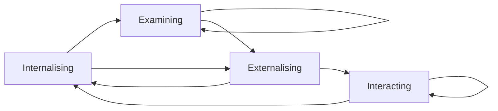
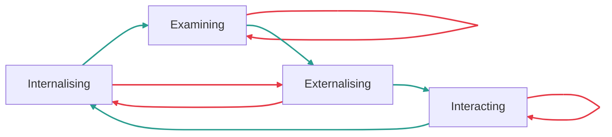
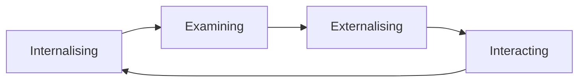
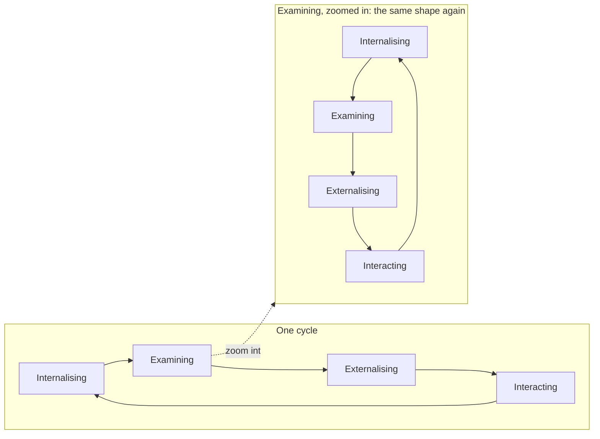

# Uriam — Reference

Strict definitions and lookup tables. No narrative, no metaphor beyond what's needed to define a term. For the full explanation of why any of this works, see [`fundamentals.md`](./fundamentals.md). For the framework's history, see [`origin.md`](./origin.md).

Two tiers below. **Core Concepts** are facts — what a term *is*, no rationale attached. **Usage** is how each concept gets *applied* — techniques, decision criteria, comparisons. Core Concepts are foundational enough that `fundamentals.md` echoes them (in prose, or as a table where prose can't substitute); Usage material is never duplicated there — `fundamentals.md` only links to it.

---

## Core Concepts

- **Node** — describes behavior. Active: it does work.
- **Edge** — a relationship between Nodes. Passive: it does no work.
- **Loop** — an Edge connecting a Node back to itself.
- **Hop** — an Edge connecting one Node to a different Node.
- **Information** — a representation of something in the observable universe. What a Node takes in as Stimulus and puts out as Response.
- **Internal / External** — not a property of a medium or a body part, but of ownership: Information owned by an Actor is Internal to it; Information it doesn't own is External. Ownership doesn't move when dormant Information merely comes back into view — recalling something you already knew isn't new Information arriving. A store counts as internal to an Actor if it's part of that Actor's own persistent state — memory, understanding, model weights — regardless of whether the Actor is human or a mechanism, and regardless of whether anything resembling human comprehension occurs. A sensor's reading sitting in a file nobody consults is external to everyone; the same reading entering a system's own long-term memory is Internal, for that system, because the memory is genuinely its interior.
- **Internalising** — External source → internal target. Something outside becomes part of what you know.
- **Examining** — Internal source → internal target. Working on what you already have; nothing new enters, nothing yet leaves.
- **Externalising** — Internal source → external target. Internal reasoning made legible to someone or something outside yourself.
- **Interacting** — External source → external target. Acting on the world; the world responds; something new exists that didn't before.
- **The Matrix** — The 2×2 grid of source (where input comes from) × target (where output goes) that the four stages derive from.
- **The Cycle** — The four stages' one stipulated order: Internalising → Examining → Externalising → Interacting → Internalising. Stated as its own fact, not derived from the Matrix alone — Examining and Externalising both start from an internal source, and Internalising and Interacting both start from an external one, so source type alone never determines which stage comes next.
- **Adjacent** — A Hop that follows the Cycle. Not every valid Hop is Adjacent — a Response can validly reach a stage other than the next one in the Cycle (Internalising can hand straight to Externalising, skipping Examining, on a perfectly valid transition) — but only Adjacent Hops count toward Momentum.
- **Actor** — A person or an AI system: whatever is capable of being assigned to a Role (from ArchiMate's Business Actor).
- **Role** — A named, illustrative way of doing an Actor's work — the Student, Johnny 5, the Philosopher, Hercule Poirot, the Maker, Leonardo da Vinci, the Witness, Snoopy, and others. Held by an Actor, drawn from its Repertoire. A Role's fit to a given Node is a matter of degree, chosen for the moment, not a fixed assignment — the same way a technique is chosen from a menu rather than mandated by the stage. One Actor can be assigned several Roles, including more than one within a single exchange (from ArchiMate's Business Role).
- **The Repertoire** — The full set of Roles available to a single Actor. Not partitioned one-per-Node: each Node has a whole group of Roles that tend to fit it well, each bringing its own register, and a Role can belong to more than one Node's group. Not several distinct performers, either — one Actor, drawing on whichever Role, from whichever group, best fits the Node it's currently occupying. Supersedes "the Cast," which implied both several distinct performers and exactly one fixed Role per stage — the Cast does not survive the Uriam reframe; the Repertoire replaces it.
- **Internalising's Roles** — Most often reached for: the Student, a measured researcher turning what's out there into internal understanding; or Johnny 5 (*Short Circuit*), the same job in an urgent, "Input! Input!" register.
- **Examining's Roles** — Most often reached for: the Philosopher, interrogating what Internalising gathered until it becomes an actual idea; or Hercule Poirot, the same job played as cold deduction from what's already known — "the little grey cells."
- **Externalising's Roles** — Most often reached for: the Maker, turning an idea into a take specific enough to be wrong, with their own hands — vocational, not rhetorical; or Leonardo da Vinci, the same job as artist and engineer, notebook and blueprint on the same page.
- **Interacting's Roles** — Most often reached for: the Witness, watching what the world does with a take and holding off reaching back in until there's real signal; or Snoopy, the same job in a laid-back, unhurried register.
- **The Conductor** — Different in kind from the Roles above, not just a further group member: it isn't a matter of fit to any Node at all, because it owns no Node's content, only the process. Three concrete jobs: generating candidate cues (proposing what a crossing could look like, without unilateral authority to call it), hosting the Interaction where a cue actually gets decided (Notes), and self-declaring whichever Role's work is in progress so every Actor involved can track where things stand. Can act mid-stage, not only at a fixed cue, when momentum is under threat. A facilitator, in the formal sense: owns the process, not the content — and never the sole Approver; see "Decision Rights at a Cue (DACI)" below. Named to match the musical-theatre analogy (see `analogy-production.md`): this Role doesn't perform any Node's content, it decides which Role plays next and when — the same job a conductor does for an orchestra already capable of playing without one.
- **Cue** — The fixed crossing point between one stage and the next. Four per cycle, named Separate, Elect, Enable, and Sense.
- **Notes** — What happens at a cue: a check of what's understood against what's needed, before the Hero moves on. Quiet by default; a full multi-voice version exists ("Convening the Repertoire for review" in the skill file — see "Usage," below, for when it earns its cost).
- **Collaboration** — The set of Actors currently assigned to Roles for a given cycle (from ArchiMate's Business Collaboration: two or more roles working together).
- **Interaction** — A full cycle, start to finish, performed jointly by a Collaboration (from ArchiMate's Business Interaction: the collective behaviour a Collaboration performs). Every cue's Notes is a smaller Interaction nested inside it — the Fractal Property, one level down.
- **Ceremony** — Informal name for an Interaction in progress. Unlike Scrum's ceremonies, never schedule-bound: a Ceremony convenes when the work is ready, not on a clock.
- **Hero** — Not a Role with content of its own, the way the Repertoire's Roles are. A plain, deictic label for whichever Actor currently owns the Uriam Graph in play — "you're the Hero here" just means "this is your cycle." Already implied by primitives.md's "a Uriam Graph is owned by an Actor"; Hero names that fact for a reader rather than adding a new one.
- **Velocity** — The number of Hops. Says nothing about which ones — churn and genuine progress both register the same.
- **Repetitions** — The number of Loops.
- **Momentum** — The number of Adjacent Hops: movement that follows the Cycle, not just movement to somewhere different. High: each revolution lands on the next stage in order.
- **A note on quality** — Uriam's measures don't concern the quality of Information or of a stage's own behavior. Whether a given Loop was worthwhile deliberation or stuck rumination, or a Response was honest but not true, are real distinctions — just not ones these counts make. See "State, Ownership, and Activation" in `references.md` for the related Working Set discussion.
- **Home box** — The stage someone gravitates toward, where they spend disproportionate time.
- **Neglected character** — The Repertoire Role someone most often avoids meeting.
- **The Fractal Property** — Every stage is itself a full cycle; the framework applies recursively at any granularity, cues included. (One optional way to picture this — a staircase inside a staircase — is in `analogy-spiral.md`.)
- **Reach levels** — The scope of knowledge in play at any stage: World, Enterprise, Division, Team, Self.
- **Code-switching** — Deliberately changing Role to fit context, while one continuous self persists underneath doing the switching. Choosing which Role within a Node's whole group to play — the Philosopher's rigour versus Poirot's deduction, say — is the same move at finer grain.

### The Matrix

| | **Internal target** | **External target** |
| --- | --- | --- |
| **External source** | **Internalising** | **Interacting** |
| **Internal source** | **Examining** | **Externalising** |

### The Repertoire

Groups, not owners: each Node has a whole group of Roles that fit it well, not one exclusive resident — and a Role can belong to more than one Node's group. (Does the Cast survive the Uriam reframe? No — this table is what replaces it.)

| Node | Roles that fit well here | What they help you do |
| --- | --- | --- |
| **Internalising** | The Student · Johnny 5 (*Short Circuit*, urgent register) | Turn what's out there into internal understanding |
| **Examining** | The Philosopher · Hercule Poirot ("little grey cells," deductive register) | Turn what Internalising gathered into an actual idea |
| **Externalising** | The Maker · Leonardo da Vinci (vocational, hands-on register) | Turn the idea into a take specific enough to be wrong |
| **Interacting** | The Witness · Snoopy (laid-back, unhurried register) | Watch what the world does with it, without reaching back in before there's real signal |

Not four fixed residents, and not five different performers — one Actor, drawing on whichever Role, from whichever Node's group, best fits the moment. See "Role" and "The Repertoire" under Core Concepts, above.

### The Cues

| Cue | Verb | What Notes decide |
| --- | --- | --- |
| Internalising → Examining | **Separate** | Separate what happened from what it felt like — decide what's actually worth thinking about |
| Examining → Externalising | **Elect** | Choose a direction; commit to a take specific enough to be wrong |
| Externalising → Interacting | **Enable** | Clear whatever stands between the plan and actually doing it |
| Interacting → Internalising | **Sense** | Notice what the outcome taught you, before deciding what to internalise from it |

### Reach Levels

| Reach | What it is | Example in Uriam |
| --- | --- | --- |
| **World** | External peer knowledge | Conference corpus, published research |
| **Enterprise** | Organisational knowledge | Company positioning, strategy documents |
| **Division** | Team/department knowledge | GTM decisions, product roadmap |
| **Team** | Immediate colleagues | Slack conversations, shared decisions |
| **Self** | Personal knowledge and experience | Your own expertise, intuition, history |

### Movement

Every stage has a source type (Internal or External) and a target type (Internal or External) — see "The Matrix," above. An Edge only ever carries Internal-to-Internal or External-to-External — a single Edge can never cross Internal↔External, only a stage itself can. That rules out eight of the sixteen theoretically possible stage-to-stage pairings before Momentum or the Cycle even enter the picture; these diagrams show which of the remaining eight each Movement concept refers to.

**Velocity** counts every valid transition, regardless of whether it follows the Cycle — the full space of possible movement once Internal/External-crossing pairings are excluded:

Notice Internalising and Externalising never point back to themselves — see "Edges," above: looping directly would require exactly the Internal↔External crossing an Edge can't make. Only Examining and Interacting can Loop.

**Adjacent** — green transitions follow the Cycle's stated order; red transitions are valid Hops (or Loops) that don't:

**Momentum** — only the Adjacent Hops: the one fixed cycle, in its actual order:

**The Fractal Property** — every stage is itself a full copy of the same cycle:

---

## Usage

How the concepts above get applied — techniques, decision criteria, comparisons. Nothing in this section is duplicated in `fundamentals.md`; it's linked to instead.

### Techniques Each Character Draws On

Each character's job description is deliberately abstract — "turn the idea into a take specific enough to be wrong" has to mean something different for a personal decision than for a software spec. Rather than pick one universal technique per character (tried, and broke immediately on the framework's own README example: "As a traveler, I want to visit Geneva" is not a real articulation technique), each character has a menu of established, named, well-documented methods to draw from — pick whichever one's actual domain matches the situation. The specific reference matters: it's what lets both the skill and the model agree on exactly what a name denotes, rather than a vague gesture at "be more rigorous." See `SKILL.md` for when it's appropriate to name one of these out loud versus translate it into plain language. Choosing which Role to play, from a Node's whole group (above), is this same menu logic one level up — a Role and a technique are both picked to fit the moment, not fixed in advance.

#### The Student (Internalising)

| Method | Specific reference | Fits because |
| --- | --- | --- |
| After-Action Review | US Army's 4-question format (expected/actual/why/next) | Converts an outcome's verdict into reusable knowledge |
| Blameless Postmortem | Google SRE Book's postmortem culture | Extracts lessons from failure without assigning blame |
| Kolb's Reflective Observation | Kolb's Experiential Learning Cycle, stage 2 specifically | Digests raw experience before forming any concept |
| Start/Stop/Continue | Standard Agile retrospective format | Recurring ritual turning outcomes into forward action |

#### The Philosopher (Examining)

| Method | Specific reference | Fits because |
| --- | --- | --- |
| Socratic Method | Platonic elenchus (self-questioning to test a claim) | Interrogates a claim already held, unexamined |
| Dialectical Reasoning | Hegelian thesis-antithesis-synthesis triad | Reconciles opposing ideas already in mind |
| First Principles Thinking | Cartesian/Aristotelian decomposition to fundamentals | Strips a concept down, rebuilds from scratch |
| Six Thinking Hats | De Bono's six sequential lenses | Forces six angles onto the same material |
| Second-Order Thinking | Munger's latticework of mental models | Traces downstream consequences of an existing idea |
| Hermeneutic Circle | Whole-informs-parts-informs-whole interpretive method | Whole reframes parts; parts refine the whole |
| Double-Loop Learning | Argyris & Schön's governing-variables model | Questions whether the goal itself was right, not just what happened |
| 5 Whys | Toyota Production System root-cause technique | Chases a symptom back to its actual cause |

#### The Maker (Externalising)

| Method | Specific reference | Fits because |
| --- | --- | --- |
| SMART Goals | Doran's 1981 Specific/Measurable/Achievable/Relevant/Time-bound | Makes intent checkable, not just aspirational |
| User Stories + Acceptance Criteria | Mike Cohn's Agile format | Frames a need as testable, falsifiable intent |
| PRD | Standard product-requirements-document format | Commits problem and requirements before building starts |
| RFC / ADR | Nygard's Context-Decision-Consequences template | Records a decision's reasoning so it's challengeable |
| The Pyramid Principle | Barbara Minto's MECE, conclusion-first structure | Leads with the answer, then structures support |
| PR-FAQ | Amazon's "Working Backwards" pre-build press release | Writes the finished result before anything's built |
| Pre-mortem | Gary Klein's 2007 HBR "Project Premortem" | Imagines failure before it happens, and writes the mitigation into the plan |
| Definition of Done | Scrum Guide's completion-criteria artifact | Commits, in writing, what "actually finished" will mean |

#### The Witness (Interacting)

| Method | Specific reference | Fits because |
| --- | --- | --- |
| PDCA's "Do" phase | Deming/Toyota Plan-Do-Check-Act cycle | The plan meets real-scale resistance; nothing left to do but watch whether it holds |
| Chaos Engineering | Netflix's Principles of Chaos Engineering | Exposes a live system to injected failure and watches how it actually responds — the fault is triggered once, everything after is observation |
| Canary Deployment / A-B Testing | Progressive-delivery and controlled-experiment practice | Releases a change into real traffic and reads the world's actual response before anyone decides what to do about it |
| Observability (SRE practice) | Dashboards and monitoring built to watch a live system without touching it | Lets the world's actual state be seen in real time, with zero requirement to act until there's real signal — the interrupt-driven version of watching, not the anxious-polling one |

#### The Conductor

| Method | Specific reference | Fits because |
| --- | --- | --- |
| Kanban WIP Limits | Anderson's Kanban Method | Caps work in progress at a Node so a growing queue forces a decision about crossing, rather than being absorbed silently |
| Timeboxing | Standard agile / personal-productivity practice | Forces a crossing to the next Node at a fixed point in time, regardless of whether the current Node's work feels finished |
| Daily Standup | Scrum Guide's Daily Scrum | A recurring ritual whose entire content is stating where things stand and what's next — the Conductor's self-declaring job, made routine |
| Incident Commander | SRE incident-response practice | A role that owns no technical content, only the call on severity and who acts next — the clearest real-world example of a Conductor-shaped role outside AI orchestration frameworks |

Unlike the four Roles above, none of these techniques does a Node's content work — each one only governs *when* a crossing happens or *whose turn* it is, which is exactly the Conductor's job, not stage-content work.

None of these are mandatory and none is "the" technique for a character — they're a vocabulary of well-trodden, nameable patterns to reach for instead of reasoning from a vague personality trait.

### Testing Whether an Act Belongs to a Quadrant

A word can sound like it belongs to a quadrant because it's culturally associated with that territory, not because it passes the matrix's own source/target logic. Five checks, run in order, catch most misclassifications:

1. **Source test.** Does the act require the Actor's own *current* internal state — an idea, a feeling, a plan held right now — as its origin? If yes, internal source. If the act operates on something already external to the Actor (an artifact, a system, another Actor's output) regardless of anyone's current internal state, external source.
2. **Target test.** Does the effect land in comprehension (the Actor's own, or another's) or as an observable change in the world? Comprehension is an internal target; an observable change — an object, an event, a system state — is an external target.
3. **Fractal trap.** Does the candidate word, in ordinary use, already name a whole role or process that itself cycles through all four stages (planning, marketing, parenting, coaching)? If so, it names a cycle, not a quadrant — exclude it rather than force it into one box.
4. **Whose-cycle test.** If the act appears to depend on what happens inside another Actor's head — their opinion, their choice, their understanding — that event belongs to their cycle, not the Actor being classified. The act that actually belongs to the Actor being classified is only the external move that made the other Actor's event more likely, not the other Actor's internalising of it.
5. **Mechanism-blindness.** Which body part, tool, or medium carried out the act — hands, eyes, a keyboard, a server — is irrelevant to its classification. Only the source and target of meaning matter.

Applied to this framework's own history: every name this framework has ever given its fourth stage — Do (1999), Creating (2011), Create (2026-06-29), Build (2026-07-02) — fails the source test the same way. Each requires the Actor's own current internal state (an intention, a design, a vision) as its origin, with the result landing externally. That is Internal → External, the same crossing as writing or speaking, just carried out with different tools — not External → External. The fourth quadrant had never had a name that actually described it, until Interacting (2026-07-09).

### The Phrase Test

The five tests above check whether an act's *direction* is correctly classified. They don't catch a different failure: a candidate word can point the right direction and still be the wrong choice, because of what it drags in connotatively or how awkwardly it sits in an actual sentence. A practical check for this: embed the candidate word in the exact self-referential sentence this framework would actually produce, and listen for whether it reads naturally or fights itself.

For a candidate Internalising-word, test: *"Before I internalise this, do I understand how it was [candidate word]-ed by others?"* For a candidate Externalising-word, test the mirror: *"Before I externalise this, do I understand how it will be [candidate word]-ed by others?"*

This single move catches two different failures at once. It exposes bad grammar fit — a word that doesn't take the passive "-ed by others" construction naturally usually isn't the right choice (this disqualified Precipitate for Interacting: "was this precipitated by others" is stilted, because precipitate wants an event as its object, not information, passed through it). And it exposes connotation a dictionary definition won't reveal — sometimes fatally (Synthesize drags "synthetic" into a sentence where authenticity was the entire point), sometimes in the candidate's favour (Propagate's adjacency to "propaganda" looks like a liability in isolation, but "was this propagated by others" is close to literally asking "was this propaganda?" — precisely the due-diligence question worth asking before internalising something).

### The Conductor — Who Plays the Role

This table describes who's *eligible* to hold the Role for a given flow type, not a fixed assignment for a whole exchange — within a single live AI ↔ Human exchange, the Role passes back and forth turn by turn (whoever proposes the next step, or reflects back what was just said, is holding it for that turn). See `analogy-production.md`'s "Facilitation can change hands" for the concrete case.

| Flow | Who plays the Conductor | Grounding |
| --- | --- | --- |
| **Human, solo** | Internal executive function — the transition/initiation faculty, distinct from the content-generating faculty | Zimmerman's self-regulated learning cycle; Gollwitzer's implementation intentions; executive-function research on task-initiation (the well-documented gap between having an idea and acting on it) |
| **AI, solo** | Orchestrator logic — iteration budgets, reflection nodes, the state machine governing phase transitions | ReAct's missing Externalising step is this failure mode by another name: no governance of when Examining ends, so the loop thrashes or never converges |
| **AI → Human** | Neither side unilaterally — the call emerges from Notes, the joint check between them. The AI can generate candidate cues and self-declare its own stage; flagging the crossing for a human isn't its Role to hold alone | Horvitz's mixed-initiative interaction research; automation bias (deferring the crossing decision to the AI even when it's wrong) is exactly the failure mode of skipping that joint check |
| **Human → Human** | A distinct, named role in the group — not the person doing the Internalising, Examining, Externalising, or Interacting | Scrum Master; meeting facilitator; chief of staff; the literal orchestral conductor, who sets the tempo but plays no instrument |
| **AI → AI** | A supervisor/manager agent whose only output is whose turn it is and whether the phase is complete | Already shipped: LangGraph's supervisor pattern, AutoGen's `GroupChatManager`, CrewAI's hierarchical-process manager, MetaGPT's SOP-driven role router |

### Non-Linearity and Entry Points

| Entry point | Who does this | Risk |
| --- | --- | --- |
| **Internalising first** | Researchers, readers, the cautious | Never meeting the Maker |
| **Examining first** | Strategists, overthinkers | Thinking without sufficient raw material |
| **Externalising first** | Managers, executors | Articulating based on assumptions, not evidence |
| **Interacting first** | Builders, hackers, the impatient | Learning only from failure, expensively |

### Relation to Other Frameworks

| Framework | Internalising | Examining | Externalising | Interacting | What Uriam adds |
| --- | --- | --- | --- | --- | --- |
| **Bloom's Taxonomy** | Remember / Understand | Analyse / Evaluate | — | Create | The matrix; the Repertoire; non-linearity |
| **Kolb's Cycle** | Concrete Experience | Reflective Observation | Abstract Conceptualisation | Active Experimentation | The Repertoire; momentum; fractal property |
| **ReAct (AI agents)** | Observe | Think | — | Act | **Externalising** — the missing stage in most AI agents |
| **OODA Loop** | Observe | Orient | Decide | Act | Fractal property; momentum; home boxes |
| **Six Thinking Hats** | White Hat | Red/Black/Yellow | — | Green Hat | The matrix; the four-move structure; the Blue Hat is Six Thinking Hats' own Conductor, not an Externalising-analog — the same missing-Externalising gap ReAct has, just less visible |
| **Hermeneutic Circle** | — | The whole circle | — | — | Uriam externalises what the circle keeps internal |
| **Belbin Team Roles** | — | — | — | — | Independent validation for **the Conductor**: Belbin's Coordinator role was originally named "Chairman" before being renamed — the same correction, authority word to process word, that this framework just made |
| **Multi-agent orchestration** (AutoGen, CrewAI, LangGraph) | Retrieval / tool nodes | Worker-agent reasoning | Task routing | Worker-agent execution | Confirms **the Conductor** is buildable: supervisor/manager agents already do this exact job in production, without performing any Internalising/Examining/Externalising/Interacting work themselves |

### Applying Uriam to AI System Design

| Uriam stage | What an AI system does |
| --- | --- |
| **Internalising** | Corpus ingestion, retrieval, contextual grounding |
| **Examining** | Reasoning, chain-of-thought, multi-perspective critique |
| **Externalising** | Structured output, task decomposition, response framing |
| **Interacting** | Not the tool call itself (that's Externalising — the source is the agent's own current internal decision). Interacting is what happens after: a triggered pipeline resolving, a canary holding or failing, a webhook firing — something already-external producing a response with no Actor's current internal state driving it |

### Decision Rights at a Cue (DACI)

RACI is the wrong lens for who does what at a cue — its "Accountable" means answerable for the outcome, which sits awkwardly on a Conductor that explicitly owns no content. DACI fits because it separates authority to proceed from ownership of the work:

| DACI role | Who plays it | Why |
| --- | --- | --- |
| **Driver** | The Hero | Owns getting the work done and actually crosses the cue |
| **Approver** | *Emergent from Notes* — the joint Interaction between whoever holds Hero and whoever holds Conductor, not either Role's unilateral call | Neither Actor has complete knowledge of the situation, their own or the other's, so the call to proceed is negotiated, not owned — the second DACI cell here that resists a single fixed owner, alongside Informed below |
| **Contributor** | The convened Repertoire member(s) | Supply expertise and critique; never decide whether to move on |
| **Informed** | Whoever the output ultimately reaches | Doesn't map onto a single fixed role — a reader, a stalled human, a downstream teammate — it depends on the flow in play |

### Convening the Repertoire — The Mechanics

The full procedure behind `SKILL.md`'s mode (c). Runs as a structured multi-voice critique in a single response, not a conversational nudge:

1. **Conductor opens.** 2-3 sentences: which Node does this exchange actually sit in, and which one or two Repertoire Roles are best placed to critique it? Don't convene all four by default — an Internalising-stage exchange rarely needs the Witness's outside-response lens, and a diluted panel adds noise, not signal. Convene more only if asked, or if the exchange genuinely spans multiple Nodes.
2. **Before writing a single word of critique, read this document's "Techniques Each Character Draws On" table directly — do not proceed from memory of what it probably says.** The specific references are the entire point of that table. For each convened Role, pick the one row whose domain actually matches this exchange (SMART goals for a personal decision, PRD/RFC for a technical one) — don't default to the same technique regardless of context.
3. **Each convened Role critiques in turn, explicitly naming the exact method they picked from the table** — not a paraphrase of the character's general vibe. "Using a pre-mortem: ..." or "Via Socratic questioning: ..." at the start of that Role's paragraph, then the critique. This is the one deliberate exception to `SKILL.md`'s no-jargon-leaks rule: this mode is an explicit analytical artifact the user asked for, not organic conversation, so naming the technique is appropriate — the same way a code review naming "the DRY principle" is fine because that's exactly the register the user invoked. If two convened Roles converge on the same point, the panel isn't adding value.
4. **Conductor closes.** 3-4 sentences synthesizing the convened voices into one judgment call and a concrete recommendation — a decision about what should change, not a summary of what was said.

### Deciding When to Hold Full Notes

A full Notes session — the multi-voice mode described in `analogy-production.md`'s "The Cues," implemented as "Convening the Repertoire for review" in the skill file — costs real tokens, real latency, and real attention. Most cues shouldn't pay for it. An agent implementing this framework needs an actual rule for when the expense is worth it, not "use your judgement":

| Signal | Favors quiet Notes (default) | Favors full Notes |
| --- | --- | --- |
| **Position in the fractal hierarchy** | An interior cue, inside a nested sub-cycle | A cue that closes the top-level cycle — the one whose output actually reaches the user or takes an action |
| **Cost of being wrong** | Cheap to redo — another Internalising pass, a discarded draft | Expensive or irreversible — commits to a claim that gets published, or an Interacting that changes external state |
| **Evidence quality** | The last stage's output is unambiguous — one clear reading | The evidence genuinely supports more than one defensible interpretation — thin corpus, conflicting sources, a close call |
| **Momentum history** | First time at this cue this cycle | The same cue has been crossed and re-crossed without real progress — a quiet call already failed once |
| **Explicit request** | Not asked for | Explicitly asked for ("convene the Repertoire on that," "run a Uriam review") |

Default to quiet. Convening is the exception that earns its cost, not the baseline behaviour — the multi-agent orchestration frameworks above converged independently on lightweight supervisors precisely because full multi-voice deliberation on every step is too expensive to run by default. A Claude Code implementation working against real data can treat this table as literal branching logic: score the cue against these five signals, and only pay for a full Notes session when at least the fractal-position signal and one other both point that way.
